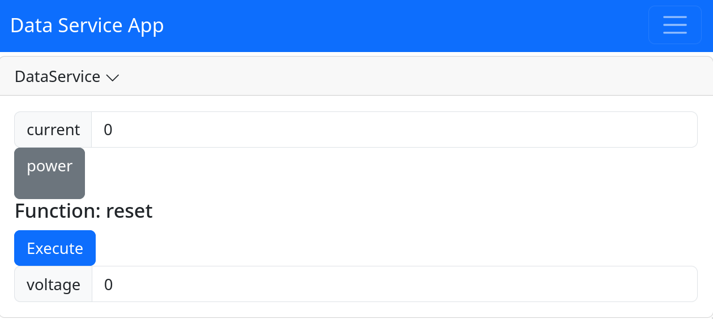

# pydase (Python Data Service)

`pydase` is a Python library for creating data service servers with integrated web and RPC servers. It's designed to handle the management of data structures, automated tasks, and callbacks, and provides built-in functionality for serving data over different protocols.

## Features

- Integrated web and RPC servers
- Automated task management
- Event-based callback functionality for real-time updates
- Built-in support for serving data over different protocols
- Support for additional servers for specific use-cases

## Installation

Install pydase using [`poetry`](https://python-poetry.org/):

```bash
poetry add git+https://github.com/tiqi-group/pydase.git
```

or `pip`:

```bash
pip install git+https://github.com/tiqi-group/pydase.git
```

## Usage

Using `pydase` involves two main steps: defining a `DataService` subclass and then running the server.

### Defining a DataService

To use pydase, you'll first need to create a class that inherits from `DataService`. This class represents your custom data service, which will be exposed via RPC (using rpyc) and a web server. Your class can implement class / instance attributes and synchronous and asynchronous tasks.

Here's an example:

```python
from pydase import DataService

class Device(DataService):

    _current = 0.0
    _voltage = 0.0
    _power = False

    @property
    def current(self):
        # run code to get current
        return self._current

    @current.setter
    def current(self, value):
        # run code to set current
        self._current = value

    @property
    def voltage(self):
        # run code to get voltage
        return self._voltage

    @voltage.setter
    def voltage(self, value):
        # run code to set voltage
        self._voltage = value

    @property
    def power(self):
        # run code to get power state
        return self._power

    @power.setter
    def power(self, value):
        # run code to set power state
        self._power = value

    def reset(self):
        self.current = 0.0
        self.voltage = 0.0
```
In the above example, we define a Device class that extends DataService. We define a few properties (current, voltage, power) and their getter and setter methods.

### Running the Server

Once your DataService is defined, you can create an instance of it and run the server:

```python
from pydase import Server

# ... defining the Device class ...

if __name__ == "__main__":
    service = Device()
    Server(service).run()
```

This will start the server, making your Device service accessible via RPC and a web server at http://localhost:8001.

### Accessing the Web Interface

Once the server is running, you can access the web interface in a browser:



In this interface, you can interact with the properties of your `Device` service.

## Documentation

For more details about usage and features, see the [full documentation](URL_TO_YOUR_DOCUMENTATION).

## Contributing

We welcome contributions! Please see [CONTRIBUTING.md](URL_TO_YOUR_CONTRIBUTING_GUIDELINES) for details on how to contribute.

## License

`pydase` is licensed under the [MIT License](./LICENSE).